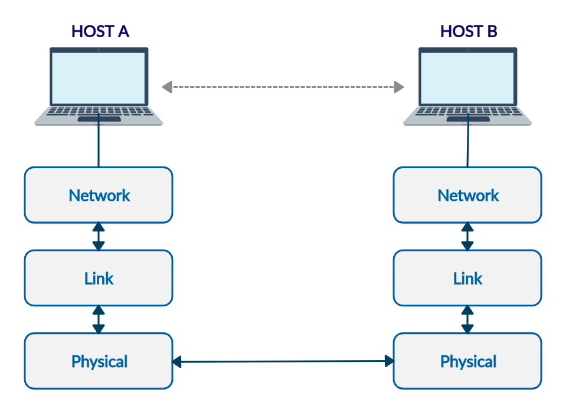

<h1 align="center">Wireless Network Simulator 📡</h1>

<h4 align="center">
  A wireless network simulator developed in python, as a final project of the wireless networks course at UFPB.
</h4>

<p align="center">
  <a href="https://www.overleaf.com/project/5e87ee38b01f50000176e3e6" target="_blank">
    
  </a>
  <a href="https://github.com/marismarcosta/wireless-network/blob/master/LICENSE" target="_blank">
    
  </a>
  
  
  
  <a href="https://github.com/marismarcosta">
    
  </a>
  <a href="https://github.com/EraldoCi">
    
  </a>
  <a href="https://www.linkedin.com/in/marismarcosta/">
    
  </a>
  <a href="https://www.linkedin.com/in/gustavoeraldo/">
    
  </a>
</p>

<p align="center">
  <a href="#workflow">Workflow</a>&nbsp;&nbsp;&nbsp;|&nbsp;&nbsp;&nbsp;
  <a href="#layers">Layers</a>&nbsp;&nbsp;&nbsp;|&nbsp;&nbsp;&nbsp;
  <a href="#setup">Setup</a>&nbsp;&nbsp;&nbsp;|&nbsp;&nbsp;&nbsp;
  <a href="#run">Run</a>&nbsp;&nbsp;&nbsp;|&nbsp;&nbsp;&nbsp;
  <a href="#license">License</a>
</p>

## Workflow

The project aims to implement a wireless network simulator, with definition of layers: physical, link and network. Using concepts such as hosts, communication protocols, position of devices in an environment, in order to evaluate the performance of the system.

<p align="center">
  
</p>

## Layers 

Write some description

### Physical 

The physical layer is responsible for sending packets from one physical interface to others, through the propagation of a signal.

### Link 

#### MAC Protocol

The master coordinator is responsible for keeping a list of the packages to be sent, allowing the forwarding of only 1 at a time, respecting the order of arrival, to avoid signal collisions.      


### Network

#### DSR Protocol

The Dynamic Source Routing Protocol (DSR) is a routing technique, which the sender determines the complete sequence of host responsible for forwarding the packets to the receiver. Then, each node stores a routing table, which contains the routes known to each.

The protocol is divided into two parts, route discovery and route maintenance. On the one hand, the overhead in the discovery process is reduced, however if the network is highly mobile on the connected devices, there is a need for greater concern with the maintenance of routes. Packages that travel over the network can be classified into three categories:

  - RREQ: 
  - RREP:
  - DATA:

## Setup

### Creating a host

Create a host by wirting ` new_host = host(host_id, x_position, y_position, master, range_ratio) ` into the main.js. The **master** <br> is the entity that decides which host will send data, so you must create only one master. 

### Creating a data package ###

Create a data package for any host by : `host_name.send_message("message content", receiver_host_id)`

## Run 

Go into the file project then open the terminal and write the command bellow :

```
python main.py
```

## Show your support

Give a ⭐️ if this project helped you!

## License 

Copyright © 2020 [Marismar da Costa Silva](https://github.com/marismarcosta), [Gustavo Eraldo da Silva](https://github.com/EraldoCi).<br />
This project is [MIT](https://github.com/marismarcosta/wireless-network/blob/master/LICENSE) licensed.
